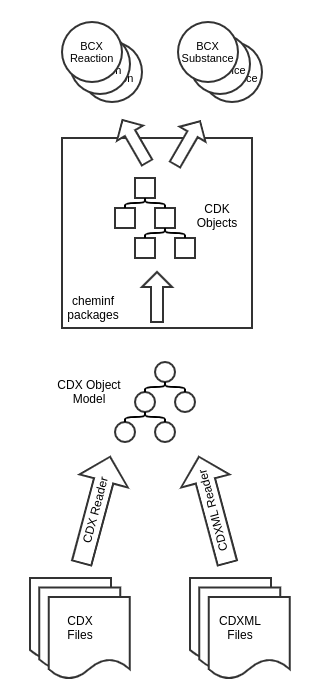
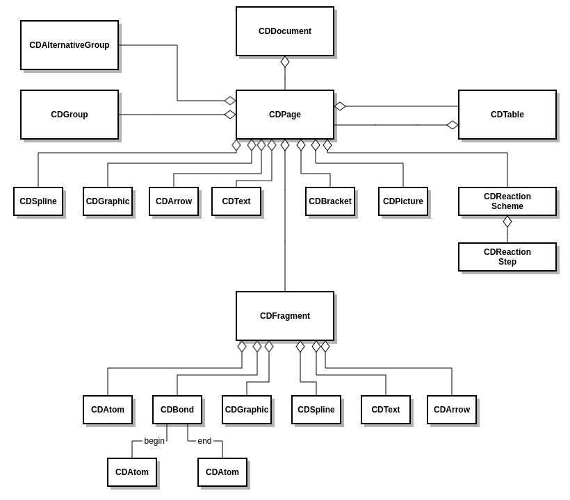

# Concepts

## Overall architecture
This chapter briefly describes the overall architecture of BChemXtract.

ChemDraw files exist in two incarnations: Either as the original binary file format (with .cdx being the file extension) or the newer XML format (.cdxml). For both formats, a parser exists that reads the data from the file system into a hierarchical in-memory model of Java objects, the CDX Object Model.

CDX files on the one hand contain a non-chemical part: Embedded images, curves, lines, non-interpretable/non-chemical text and so on. As the more interesting part, CDX files contain objects that add chemical logic to the drawing: reaction schemes, fragments/chemical structures, atoms and bonds.

The latter ones are read by the extraction software and validated through a set of chemo-informatical algorithms. During this step, the CDX objects are converted to internal Chemical Development Toolkit (CDK) objects. Most of the original CDK fragments make it through the process, some fragments however are discarded, because they are chemically invalid structures, contain drawing errors or unresolvable rests.

At the end of the workflow, the extraction software returns a set of substance or reaction objects that contain all the valid chemical logic from the drawing, either extracted or calculated:
- Substances contain an InChI, InChI key, SMILES and molecular formula.
- Reactions contain the substances participating in the reaction as well as a RInChI and RInChI key.

## CDX object model
Following we outline the ChemDraw object model, that is created in-memory during the parsing stage.

| Object             | Description                                               |
| ------------------ | --------------------------------------------------------- |
| CDDocument         | The root of the CDX object model.                         |
| CDPage             | The drawing canvas that contains all other objects.       |
| CDGroup            | An object for grouping several other objects.             |
| CDAlternativeGroup | A container that represents an R-Group.                   |
| CDTable            | A table that is made up of several page objects.          |
| CDGraphic          | Represents a graphical object without chemical meaning.   |
| CDPicture          | Represents an externally made embedded graphic.           |
| CDBracket          | Group of objects that may be repeated several times.      |
| CDText             | A block of potentially styled text.                       |
| CDArrow            | A line or an arrow with or without arrowheads.            |
| CDSpline           | This object represents a Bezier curve.                    |
| CDReactionScheme   | Describes a one- or multistep reaction.                   |
| CDReactionStep     | Single reaction step with reactants, products, agents,... |
| CDFragment         | Container with chemical semantics, usually a substance.   |
| CDAtom             | Basic part of a substance.                                |
| CDBond             | Defines a connection between atoms, has begin and end.    |

